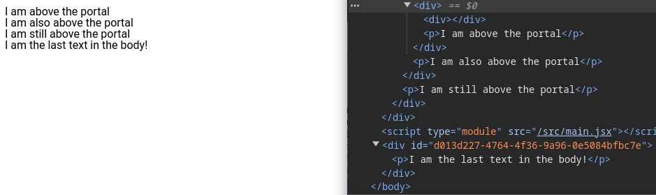

# @ouroboros/react-portal

[](https://www.npmjs.com/package/@ouroboros/react-portal) 

A React component that allows you to add children to the end of the body no matter how deep it and its parents are in the DOM.

## Installation
npm
```bash
npm install @ouroboros/react-portal
```

## Using
```javascript
import Portal from '@ouroboros/react-portal';

function App(props) {

  return (
    <div>
      <div>
        <div>
          <div>
            <Portal>
              <p>I am the last text in the body!</p>
            </Portal>
          </div>
          <p>I am above the portal</p>
        </div>
        <p>I am also above the portal</p>
      </div>
      <p>I am still above the portal</p>
    </div>
  );
}
```



## Props

| Name | Type | Required | Description |
| ---- | ---- | -------- | ----------- |
| className | string | no | CSS class name |
| id | string | no | Element ID |
| style | object | no | React.CSSProperties |

All props will be passed to the DIV element created and attached to the body. If no ID is passed, a universally unique ID will be created and added.